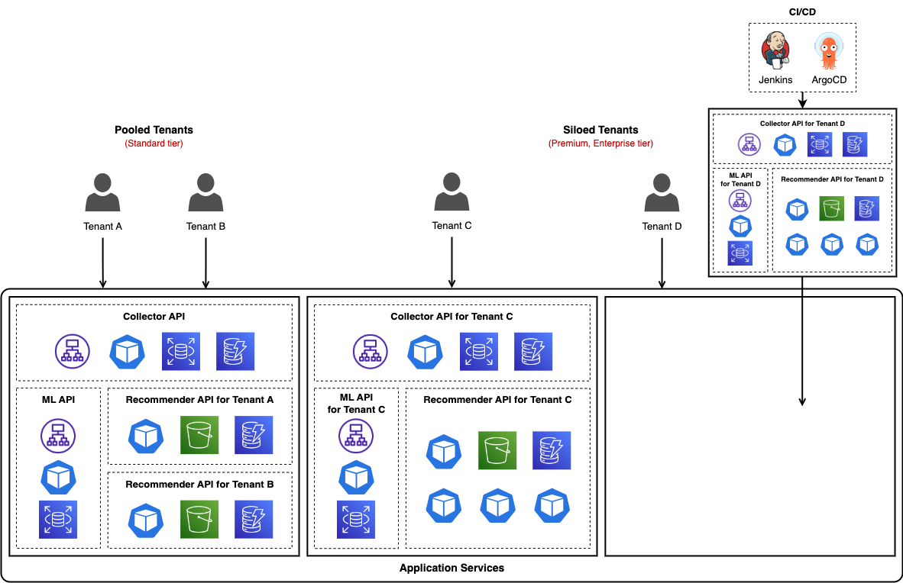

> _You can view this portfolio more conveniently at [this link](https://github.com/sunhongmin225/sunhongmin225/blob/main/README.en.md)._

<h1 align="center">Hi, I'm Sunhong Min, a DevOps Engineer.</h1>

## 📌 Table of Contents

- [💼 Work Experience](#-work-experience)
- [🎓 Education](#-education)
- [🏢 About Blux](#-about-blux)
- [🚀 Projects @ Blux](#-projects--blux)
  - [🔐 Preparing for and Passing SOC 2 Compliance Audits](#-preparing-for-and-passing-soc-2-compliance-audits)
  - [🔄 Zero-Downtime EKS Cluster Version Upgrades and Automated Blue-Green Deployment](#-zero-downtime-eks-cluster-version-upgrades-and-automated-blue-green-deployment)
  - [🧩 Enhancing EKS Cluster with SaaS Architecture Best Practices](#-enhancing-eks-cluster-with-saas-architecture-best-practices)
  - [🏗️ Building a Production-Grade EKS Cluster and Zero-Downtime ECS to EKS Migration](#%EF%B8%8F-building-a-production-grade-eks-cluster-and-zero-downtime-ecs-to-eks-migration)
- [🗣️ Publications & Talks](#%EF%B8%8F-publications--talks)
  - [🎤 Talks](#-talks)
  - [✍️ Technical Writings](#%EF%B8%8F-technical-writings)
  - [📚 Academic Publications](#-academic-publications)
- [🛠️ Skills & Languages](#%EF%B8%8F-skills--languages)
  - [🔧 Technical Skills](#-technical-skills)
  - [🤝 Soft Skills](#-soft-skills)
  - [🌐 Languages](#-languages)
- [📇 Contact Information](#-contact-information)

## 💼 Work Experience

- [Blux (Z.ai Inc.)](https://www.blux.ai/) (Jan 2023 - Jun 2025)
  - _Information Security and DevOps Lead_ (Aug 2024 - Jun 2025)
    - **Led the entire SOC 2 Type I and Type II audit process**. This included establishing internal security protocols and conducting employee training, performing backup and restore testing, carrying out risk assessments, and enhancing cloud security (e.g., CloudTrail, WAF, GuardDuty). Handled more than 100 control items and managed external audits independently. As a result, we **successfully passed both audits within 7 months with no security incidents**.
      - Related project 👉 [🔐 Preparing for and Passing SOC 2 Compliance Audits](#-preparing-for-and-passing-soc-2-compliance-audits)
  - _MLOps Engineer_ (Jan 2023 - Aug 2024)
    - **Built a production-grade EKS cluster from scratch** and **migrated ECS workloads with zero-downtime**. (This cluster currently powers a real-time recommendation service for over 10 million MAU and has been operating stably without major incidents.)
      - Related project 👉 [🏗️ Building a Production-Grade EKS Cluster and Zero-Downtime ECS to EKS Migration](#%EF%B8%8F-building-a-production-grade-eks-cluster-and-zero-downtime-ecs-to-eks-migration)
    - **Designed and implemented a multi-tenant SaaS architecture based on AWS best practices**, including automated onboarding, tier-based silo/pool deployment models, and tenant-level resource isolation using IRSA.
      - Related project 👉 [🧩 Enhancing EKS Cluster with SaaS Architecture Best Practices](#-enhancing-eks-cluster-with-saas-architecture-best-practices)
    - **Upgraded Kubernetes cluster versions with zero-downtime** using a Blue-Green deployment strategy, and **automated new cluster provisioning through scripting**.
      - Related project 👉 [🔄 Zero-Downtime EKS Cluster Version Upgrades and Automated Blue-Green Deployment](#-zero-downtime-eks-cluster-version-upgrades-and-automated-blue-green-deployment)

## 🎓 Education

- Master of Science in Computer Science and Engineering, Seoul National University (Mar 2021 – Feb 2023)
  - Conducted research on large-scale data processing and system architecture in the [Architecture and Code Optimization Lab](https://arc.snu.ac.kr/).
- Bachelor of Science in Industrial Engineering and Computer Science and Engineering (Double Major), Seoul National University (Mar 2014 – Feb 2021)

## 🏢 About Blux

- [Blux (Legal name: Z.ai Inc.)](https://www.blux.ai/) is a B2B SaaS startup that provides **hyper-personalized product recommendation and CRM marketing solutions**, developing AI-powered products to help businesses increase their revenue.
- Blux Recommendation is a real-time personalized product recommendation solution based on user behavior data. It delivers **100% real-time recommendations to over 10 million monthly end users**, helping e-commerce companies increase conversion rates by up to 7 times compared to pre-adoption performance.
- Blux Message is a hyper-personalized CRM marketing solution that determines the optimal content, timing, and channel for each user in real-time, enabling effective marketing campaigns across multiple messaging platforms.
- Blux offers a fully integrated AI solution—from custom model development to production deployment—for each client, enabling the launch of recommendation systems in just a few hours through **an automated SaaS environment**, compared to the months typically required with conventional methods.

## 🚀 Projects @ Blux

### 🔐 Preparing for and Passing SOC 2 Compliance Audits

_Aug 2024 - Mar 2025_

**Background**

- Blux provides B2B SaaS services to a number of large enterprises both in Korea and internationally. During sales engagements, it became increasingly common for clients to **require certification for global security standards such as SOC 2** as a prerequisite.
- In April 2024, under my leadership, our product successfully **passed the [AWS Foundational Technical Review (FTR)](https://aws.amazon.com/partners/foundational-technical-review/)**, which provided a broad assessment of our cloud security posture. However, when evaluated against **global standards like SOC 2 or ISO 27001**, it became clear that we lacked formalized security controls in areas such as **backup policies, endpoint protection, and disaster recovery planning**.
- As a result, the project set out with a clear goal: to **bring Blux’s security framework up to international standards** and ultimately **obtain SOC 2 Type I and Type II reports**.
- Expanding beyond my existing role as an MLOps engineer, I took on the responsibility of **leading the SOC 2 project as the sole security owner at the company starting in August 2024**.

**What I Did**

- **Established a security framework using Drata**: To align with SOC 2 security standards, I **introduced the Drata platform** as our core compliance system. Based on Drata’s 100+ control items, I systematically reviewed our organization’s technical and administrative security practices. This provided a solid foundation for consistent execution of **security policy development, evidence management, and automated compliance tracking**.
- **Strengthened security controls and infrastructure readiness**
  - **Risk assessment and policy development**: Conducted risk assessments on technical and operational vulnerabilities, and established a full set of company-wide information security policies along with detailed sub-policies based on the findings.
  - **Regular backup and recovery testing**: Designed and implemented backup plans for critical storage systems such as `S3`, `RDS`, and `MongoDB`, and conducted periodic restoration tests to ensure data recoverability.
  - **Business Continuity and Disaster Recovery (BC/DR) planning**: Defined RTO and RPO values for critical systems and documented a company-wide continuity and disaster recovery plan to prepare for potential disruptions.
  - **Internal security training and access control processes**: Standardized annual security training sessions and implemented onboarding/offboarding security checklists and access revocation procedures.
- **Key cloud security implementations**
  - **Strengthened account and permission management**:
    - Segmented `IAM Roles` by service and user responsibilities, enforcing the principle of least privilege.
    - Used `CloudTrail` to log all API activity and resource modifications, enabling real-time detection of account misuse or privilege violations.
  - **Built threat detection and defense mechanisms**:
    - Configured `WAF` rules to block malicious IPs, filter based on headers, and rate-limit requests, thereby protecting major endpoints against DoS attacks and other external threats.
    - Used `GuardDuty` to detect suspicious IAM activity, unusual network access, and intrusion attempts. Integrated `SNS` notifications to enable real-time alerting and rapid incident response.
- **Managed external audit and cross-functional collaboration**
  - Worked closely with the external auditor, AssuranceLab, to lead **pre-audit inquiry handling, control mapping reviews, and evidence submission**. Collected and organized over 100 pieces of evidence (screenshots, configuration records, system logs), and responded to all auditor inquiries with thorough documentation and technical clarification.
  - Ensured smooth audit execution through **clear and responsive communication** with various internal and external stakeholders, including international institutions and departments across the company.

**Results**

- **Successfully obtained both SOC 2 Type I and Type II reports within approximately 7 months**.
- Team-wide security awareness significantly improved, and key cloud security measures **effectively reduced or prevented real-world threats**.
  - Throughout both the preparation and post-certification periods, **no security incidents occurred**, and the audit firm provided positive feedback, stating that we had established a well-structured and effective security control framework.
- The SOC 2 reports **enhanced trust in client meetings**, and I received feedback that they were being used by the sales team as **a strong selling point**.
- **Successfully achieving global security compliance without a dedicated security team or function** demonstrated Blux’s technical capability and execution strength. This achievement was externally recognized, and I was **selected as a speaker at AWS Unicorn Day 2025**, where I delivered a presentation on our security journey.

**Related Materials**

- [📝 [May 2025, Blux Tech Blog] Blux’s SOC 2 Compliance Journey and Key Takeaways](https://blog.blux.ai/%EB%B8%94%EB%9F%AD%EC%8A%A4%EC%9D%98-soc-2-%EB%B3%B4%EC%95%88-%EC%97%AC%EC%A0%95%EA%B3%BC-%EC%9A%B0%EB%A6%AC%EA%B0%80-%EB%82%A8%EA%B8%B4-%EA%B8%B0%EB%A1%9D-49217)
- [📰 [Mar 2025, AWS Unicorn Day] Blux’s Security Journey for Its SaaS Platform (feat. SOC 2)](https://blog.blux.ai/aws-unicorn-day-2025%EC%97%90%EC%84%9C-%EC%A0%84%ED%95%98%EB%8A%94-%EB%B8%94%EB%9F%AD%EC%8A%A4%EC%9D%98-%EB%B3%B4%EC%95%88-%EC%A0%84%EB%9E%B5-48063)
  - [📄 View Presentation Deck (PDF)](./assets/AWS_Unicorn_Day_2025_Deck.pdf)

### 🔄 Zero-Downtime EKS Cluster Version Upgrades and Automated Blue-Green Deployment

_May 2024 - Jul 2024_

**Background**

- The Kubernetes version of our existing EKS cluster was nearing its official end-of-life (EOL), making a version upgrade necessary. However, upgrading a live cluster in place would pose **a significant risk of service interruption, potentially causing visible downtime or UI failures for over 10 million end users**. To avoid such impact, we opted not to modify the existing cluster directly. Instead, we decided to **provision a new cluster and gradually shift traffic using a Blue-Green deployment model**, ensuring a safer and more controlled transition.
- The key goals of this project were:
  - Seamlessly transition from the old to the new cluster **without any downtime**.
  - Use the **Blue-Green deployment model** to ensure a safe cutover, while **automating the infrastructure provisioning process** to make the upgrade repeatable in the future.

**What I Did**

  

- **Designed a Blue-Green Cluster Strategy and Managed Traffic Transition**
  - Instead of upgrading the in-use production cluster directly, I provisioned a new EKS cluster with the updated Kubernetes version and configured it for parallel operation using the naming convention `blux-eks-cluster-prod-blue` and `blux-eks-cluster-prod-green`.
  - Traffic was gradually shifted to the new cluster using Route 53’s `Weighted Routing` feature, enabling a smooth and controlled transition.
- **Automated Cluster Provisioning via Scripts**: To prepare for future upgrades or migrations, I **automated the entire infrastructure setup from our internally defined Layer 0 to Layer 3** using shell scripts. This enabled reproducible cluster environments, where only the deployment environment (`prod`, `dev`) and model (`blue`, `green`) needed to be specified to provision a new cluster automatically.
- **Migration Validation and Stability Checks with Observability Tools**: During the cutover, I monitored the system in real-time using `Prometheus`, `Loki`, and `Grafana`, focusing on the following key metrics:
  - Distribution of HTTP response codes (2XX, 4XX, 5XX) across major APIs
  - Response time and latency per API
  - Request success rates and error trends by service
- **Verified Zero-Downtime via ALB Access Logs (S3) Analysis**: After traffic redirection via Route 53, I analyzed ALB access logs stored in S3 to verify backend IP distribution and response status. This confirmed that requests were successfully routed to the new cluster and processed without errors.
- Based on these metrics, I was able to continuously detect anomalies during the migration and respond immediately to any issues.

**Results**

- **Successfully completed the cluster upgrade with zero-downtime**.
  - Stability was maintained throughout the traffic transition, and the migration was completed without any major issues.
- By developing automation scripts for cluster provisioning, I **significantly improved the efficiency** of future upgrade or migration tasks from a DevOps perspective. The setup also enabled **easy rollback** when necessary, making operations more robust and reliable.

**Related Materials**

- [📝 [Aug 2024, Blux Tech Blog] Performing Zero-Downtime EKS Cluster Version Upgrades](https://blog.blux.ai/%EB%AC%B4%EC%A4%91%EB%8B%A8%EC%9C%BC%EB%A1%9C-eks-%ED%81%B4%EB%9F%AC%EC%8A%A4%ED%84%B0-%EB%B2%84%EC%A0%84-%EC%97%85%EA%B7%B8%EB%A0%88%EC%9D%B4%EB%93%9C%ED%95%98%EA%B8%B0-25859)

### 🧩 Enhancing EKS Cluster with SaaS Architecture Best Practices

_Jun 2023 - Oct 2023_

**Background**

- As the number of Blux’s clients increased, the onboarding process required repeated manual involvement from multiple team members, including product owners, software engineers, and ML engineers. This led to inefficiencies and increased the risk of human error.
- As tenant size and requirements diversified, smaller tenants demanded cost efficiency, while larger tenants required dedicated resources and customized management (e.g., private endpoints). The existing single-tier architecture made it difficult to flexibly accommodate such a wide range of needs.
- The goals of this project were as follows:
  - Build an automated onboarding process that can **provision new tenants within 3 hours**.
  - **Apply different deployment models based on tenant size and service tier**.
  - **Establish tier-based resource isolation**, with dedicated node resources provided to high-tier tenants.

**What I Did**

  

- **Built an automated tenant onboarding pipeline**: To eliminate manual steps in the tenant onboarding process, I designed an automation pipeline based on `Jenkins`. When the ‘Add new tenant’ button is clicked in the internal Blux admin console, a Jenkins job is triggered to 1) store new tenant information in RDS, 2) initiate training of a content-based recommendation model, and 3) push changes to a GitHub repository containing Kubernetes resource definitions tailored to the tenant’s environment. These changes are then automatically detected by `Argo CD`, which triggers **automatic deployment** of services such as the Collector, ML, and Recommender APIs for the tenant.

  

- **Designed a multi-tier structure and applied deployment strategies**: To accommodate the varying sizes and requirements of tenants, I defined three service tiers: Standard, Premium, and Enterprise.
  - The `Standard tier` uses a `Pool model`, where each tenant has its own Recommender API and trained model, but **Collector and ML APIs are shared across tenants via a common infrastructure and endpoint**. These workloads run in a **shared NodePool**, making this tier well-suited for tenants with lighter usage requirements.
  - The `Premium and Enterprise tiers` adopt a `Silo model`, where **not only the Recommender API but also the Collector and ML APIs are deployed as separate instances with dedicated endpoints and infrastructure**. These tenants run in **dedicated NodePools**, ensuring full physical resource isolation. This design enables complete separation of data and traffic per tenant, offering both strong security and high flexibility, ideal for customers with strict SLA or compliance requirements.
- **Established a resource isolation structure**
  - Each tenant is isolated at the `namespace` level, and `IRSA (IAM Roles for Service Accounts)` is applied to each workload to ensure logical separation of AWS resource access.
  - For higher-tier tenants in particular, dedicated `NodePools` were provisioned so that their workloads run exclusively on physically separate EC2 nodes. This approach eliminates noisy neighbor issues caused by high-traffic tenants and guarantees high availability and consistent performance.

**Results**

- The previously manual onboarding process was **reduced to approximately 2–3 hours**, significantly cutting down on the human resources required for repetitive tasks.
- With automation applied to key steps like onboarding guidance, SDK integration, model training, and resource provisioning, **operational efficiency improved substantially**.
- A flexible SaaS architecture was established to accommodate varying tenant requirements by tier, enabling the delivery of **customized subscription models**.
- For higher-tier tenants, **dedicated nodes ensured performance guarantees**, and **isolated endpoints helped address security concerns**, contributing to increased customer satisfaction.
- This project was recognized as a successful implementation of AWS SaaS architecture best practices on EKS and was **featured on the official AWS Korea Tech Blog**, as well as **presented at AWS Unicorn Day 2024**.

**Related Materials**

- [📝 [Nov 2023, AWS Tech Blog] How a Korean Startup Built Their SaaS on Amazon EKS: Blux’s AWS Architecture Patterns](https://aws.amazon.com/ko/blogs/tech/blux-adopting-aws-saas-architecture/)
- [🎥 [Mar 2024, AWS Unicorn Day] [Track 3-4] Key Technical Considerations for Building SaaS Solutions and a Case Study of Blux’s AI SaaS Platform](https://youtu.be/QKi14XpHY7M?si=KC5pfXqaEd_y4SOZ&t=1267)
  - [📄 View Presentation Deck (PDF)](./assets/AWS_Unicorn_Day_2024_Deck.pdf)

### 🏗️ Building a Production-Grade EKS Cluster and Zero-Downtime ECS to EKS Migration

_Jan 2023 - May 2023_

**Background**

- In the early stages, Blux operated separate Amazon ECS clusters for each client. However, as the number of clients grew, we began to **experience limitations in terms of cost, operational complexity, and scalability**. ECS enforces fixed vCPU and memory combinations, making **resource utilization inefficient**, and its architecture posed challenges for **multi-tenancy** and was **tightly coupled with AWS**, limiting long-term scalability and flexibility.
- In contrast, Amazon EKS-based Kubernetes offered **flexible resource allocation**, **namespace-based multi-tenancy**, **diverse deployment strategies such as rolling, canary, and blue-green**, and access to a **rich open-source ecosystem**, making it a more flexible and automation-friendly solution.
- Internally, consensus formed around the idea of “migrating to Kubernetes before the client base grows further,” and we determined that **EKS would be a more advantageous long-term solution**. Thus, we initiated a full migration.
- As the sole MLOps engineer at Blux, I was fully responsible for **building a production-grade EKS cluster from scratch** and **migrating all ECS workloads without downtime**. The cluster needed to satisfy the following requirements:
  - **Infrastructure as Code (IaC)** with consistent and reproducible cluster configuration
  - Support for reliable **autoscaling**, **logging/monitoring**, **security management**, and **CI/CD pipelines**
  - Integration with **ML pipelines built on Airflow and MLflow**

**What I Did**

  

- **Infrastructure Design and Operational Automation**: The entire infrastructure was structured into **four layers (Layer 0 to Layer 3)**, which I defined internally with a focus on maintainability and scalability. Each layer was separated by its role and dependency on cloud services. All deployments were managed in a `GitOps` manner using `Terraform`, `Helm`, and `Argo CD`.
  - Breakdown of the four layers:
    - **Layer 0**: Backend infrastructure such as S3 and DynamoDB (now deprecated) for Terraform state storage
    - **Layer 1**: Cloud-based Kubernetes cluster and system infrastructure (EKS, EC2 node groups, IAM, KMS, etc.)
    - **Layer 2**: MLOps and GitOps stack components
    - **Layer 3**: Blux application workloads
  - Layers 0 and 1 directly depend on cloud services like AWS and are considered cloud-dependent, whereas Layers 2 and 3 are cloud-agnostic, designed to be reproducible across different environments. This architecture allowed us to build a production-grade infrastructure that is **secure, scalable, reliable, and reproducible**.

  

- **MLOps Stack Implementation**
  - For autoscaling, I combined `HPA (Horizontal Pod Autoscaler)` and `Karpenter` to support scaling at both the workload and infrastructure levels. All workloads were managed through `NodePools` (formerly known as `Provisioners`) to optimize cost.
  - To ensure observability, I established a metrics-based monitoring system using `Prometheus` and `Grafana`, and initially built a logging architecture with the `EFK` stack (Elasticsearch, Fluentd, Kibana). Later, to improve operational efficiency and reduce resource consumption, I migrated to the lighter `PLG` stack (Promtail, Loki, Grafana).
  - I deployed `Airflow` and `MLflow` in the cluster. The Airflow DAGs were designed using `KubernetesPodOperator`, which launches and terminates worker nodes only when needed. This was combined with `NodePools`, `Taints`, and `Tolerations` to dynamically provision and tear down worker nodes, allowing for efficient resource utilization.

  

- **CI/CD and GitOps-Based Operations**: I integrated the `GitHub repository` with `Argo CD` to establish a `GitOps` environment. All deployments were managed through `GitHub Actions` and pull requests, and once approved, Argo CD automatically applied the changes to the cluster. For certain custom workflows, I integrated `Jenkins` as well.
- **Workload Design and Security Hardening**: I migrated legacy ECS services to Kubernetes and restructured workloads so that those not requiring external access remained internal to the cluster. I also applied `PodDisruptionBudget` and `TopologySpreadConstraints` to maintain service availability during disruptions. Additionally, to enhance security, I managed Kubernetes Secrets using `SealedSecrets`, ensuring encrypted and secure storage.
- **Zero-Downtime Traffic Migration**: Using Route 53’s `Weighted Routing`, I gradually shifted traffic from ECS to EKS (0:100 → 100:0) over several days. Throughout the migration, continuous monitoring of metrics allowed us to complete the transition without any service interruptions.

**Results**

- The EKS cluster built from scratch was successfully implemented as a **production-grade environment using Infrastructure as Code (IaC), ensuring both reproducibility and consistency**.
- A comprehensive **autoscaling system was established** at both the workload and infrastructure levels, enabling stable and automated operations.
- I completed a full **MLOps stack** that included logging, monitoring, GitOps-based deployment, security configurations, and ML workflows.
- Compared to the previous ECS setup, the new architecture achieved **approximately 25% reduction in infrastructure costs**, while Infrastructure as Code significantly **reduced management complexity and improved transparency**.
- All ECS workloads were **migrated to EKS without downtime**, resulting in a smooth transition with no user impact.
- The cluster has been **running reliably for over two years without any critical incidents**, continuing to support key services in production.

**Related Materials**

- [📝 [Feb 2025, Blux Tech Blog] GitOps with Argo CD: How Blux Manages Kubernetes Resources](https://blog.blux.ai/argo-cd%EC%99%80-%EA%B9%83%EC%98%B5%EC%8A%A4%EB%A5%BC-%ED%99%9C%EC%9A%A9%ED%95%9C-%EB%B8%94%EB%9F%AD%EC%8A%A4%EC%9D%98-%EC%BF%A0%EB%B2%84%EB%84%A4%ED%8B%B0%EC%8A%A4-%EC%9E%90%EC%9B%90-%EA%B4%80%EB%A6%AC-%EB%85%B8%ED%95%98%EC%9A%B0-41764)
- [📝 [Jan 2024, Blux Tech Blog] Building an Autoscaling System with HPA and Karpenter in Kubernetes](https://blog.blux.ai/kubernetes-%ED%99%98%EA%B2%BD%EC%97%90%EC%84%9C-hpa%EC%99%80-karpenter%EB%A5%BC-%EC%9D%B4%EC%9A%A9%ED%95%98%EC%97%AC-autoscaling-%EC%8B%9C%EC%8A%A4%ED%85%9C-%EA%B5%AC%EC%B6%95%ED%95%98%EA%B8%B0-17394)
- [📝 [Jan 2024, Blux Tech Blog] Managing Safe Kubernetes Secrets Using Sealed Secrets in Public GitHub Repos](https://blog.blux.ai/sealed-secrets-github-public-repository%EC%97%90-%EC%98%AC%EB%A0%A4%EB%8F%84-%EB%90%98%EB%8A%94-%EC%95%88%EC%A0%84%ED%95%9C-kubernetes-secrets-17393)

## 🗣️ Publications & Talks

### 🎤 Talks

- [📰 [Mar 2025, AWS Unicorn Day] Blux’s Security Journey for Its SaaS Platform (feat. SOC 2)](https://blog.blux.ai/aws-unicorn-day-2025%EC%97%90%EC%84%9C-%EC%A0%84%ED%95%98%EB%8A%94-%EB%B8%94%EB%9F%AD%EC%8A%A4%EC%9D%98-%EB%B3%B4%EC%95%88-%EC%A0%84%EB%9E%B5-48063)
  - [📄 View Presentation Deck (PDF)](./assets/AWS_Unicorn_Day_2025_Deck.pdf)
- [📰 [Oct 2024, AWS 2024 SaaS Developer Bootcamp] How Blux Built Its AI SaaS Solution](https://blog.blux.ai/%EB%B8%94%EB%9F%AD%EC%8A%A4%EA%B0%80-%EC%A0%84%ED%95%98%EB%8A%94-aws-saas-%EC%A0%84%ED%99%98%EC%9D%98-%EC%84%B1%EA%B3%B5-%EB%B9%84%EA%B2%B0-33488)
- [🎥 [Mar 2024, AWS Unicorn Day] [Track 3-4] Key Technical Considerations for Building SaaS Solutions and a Case Study of Blux’s AI SaaS Platform](https://youtu.be/QKi14XpHY7M?si=KC5pfXqaEd_y4SOZ&t=1267)
  - [📄 View Presentation Deck (PDF)](./assets/AWS_Unicorn_Day_2024_Deck.pdf)

### ✍️ Technical Writings

- [📝 [May 2025, Blux Tech Blog] Blux’s SOC 2 Compliance Journey and Key Takeaways](https://blog.blux.ai/%EB%B8%94%EB%9F%AD%EC%8A%A4%EC%9D%98-soc-2-%EB%B3%B4%EC%95%88-%EC%97%AC%EC%A0%95%EA%B3%BC-%EC%9A%B0%EB%A6%AC%EA%B0%80-%EB%82%A8%EA%B8%B4-%EA%B8%B0%EB%A1%9D-49217)
- [📝 [Feb 2025, Blux Tech Blog] GitOps with Argo CD: How Blux Manages Kubernetes Resources](https://blog.blux.ai/argo-cd%EC%99%80-%EA%B9%83%EC%98%B5%EC%8A%A4%EB%A5%BC-%ED%99%9C%EC%9A%A9%ED%95%9C-%EB%B8%94%EB%9F%AD%EC%8A%A4%EC%9D%98-%EC%BF%A0%EB%B2%84%EB%84%A4%ED%8B%B0%EC%8A%A4-%EC%9E%90%EC%9B%90-%EA%B4%80%EB%A6%AC-%EB%85%B8%ED%95%98%EC%9A%B0-41764)
- [📝 [Aug 2024, Blux Tech Blog] Performing Zero-Downtime EKS Cluster Version Upgrades](https://blog.blux.ai/%EB%AC%B4%EC%A4%91%EB%8B%A8%EC%9C%BC%EB%A1%9C-eks-%ED%81%B4%EB%9F%AC%EC%8A%A4%ED%84%B0-%EB%B2%84%EC%A0%84-%EC%97%85%EA%B7%B8%EB%A0%88%EC%9D%B4%EB%93%9C%ED%95%98%EA%B8%B0-25859)
- [📝 [May 2024, Blux Tech Blog] Streaming Real-Time Data to S3 Using Kinesis Data Streams](https://blog.blux.ai/kinesis-%EC%8A%A4%ED%8A%B8%EB%A6%AC%EB%B0%8D-%EB%8D%B0%EC%9D%B4%ED%84%B0%EC%B2%98%EB%A6%AC-%EC%95%84%ED%82%A4%ED%85%8D%EC%B3%90-0522)
- [📝 [Jan 2024, Blux Tech Blog] Building an Autoscaling System with HPA and Karpenter in Kubernetes](https://blog.blux.ai/kubernetes-%ED%99%98%EA%B2%BD%EC%97%90%EC%84%9C-hpa%EC%99%80-karpenter%EB%A5%BC-%EC%9D%B4%EC%9A%A9%ED%95%98%EC%97%AC-autoscaling-%EC%8B%9C%EC%8A%A4%ED%85%9C-%EA%B5%AC%EC%B6%95%ED%95%98%EA%B8%B0-17394)
- [📝 [Jan 2024, Blux Tech Blog] Managing Safe Kubernetes Secrets Using Sealed Secrets in Public GitHub Repos](https://blog.blux.ai/sealed-secrets-github-public-repository%EC%97%90-%EC%98%AC%EB%A0%A4%EB%8F%84-%EB%90%98%EB%8A%94-%EC%95%88%EC%A0%84%ED%95%9C-kubernetes-secrets-17393)
- [📝 [Nov 2023, AWS Tech Blog] How a Korean Startup Built Their SaaS on Amazon EKS: Blux’s AWS Architecture Patterns](https://aws.amazon.com/ko/blogs/tech/blux-adopting-aws-saas-architecture/)

### 📚 Academic Publications

- [📃 [VLDB ‘22] Ginex: SSD-enabled Billion-scale Graph Neural Network Training on a Single Machine via Provably Optimal In-memory Caching](./assets/vldb22_ginex.pdf) by Yeonhong Park, **Sunhong Min**, Jae W. Lee
- [📃 [HPCA ‘22] ANNA: Specialized Architecture for Approximate Nearest Neighbor Search](./assets/hpca22_anna.pdf) by Yejin Lee, Hyunji Choi, **Sunhong Min**, Hyunseung Lee, Sangwon Baek, Dawoon Jeong, Jae W. Lee, Tae Jun Ham
- [📃 [ISCA ‘21] BOSS: Bandwidth-Optimized Search Accelerator for Storage-Class Memory](./assets/isca21_boss.pdf) by Jun Heo, Seung Yul Lee, **Sunhong Min**, Yeonhong Park, Sung Jun Jung, Tae Jun Ham, Jae W. Lee

## 🛠️ Skills & Languages

### 🔧 Technical Skills

- Cloud & DevOps
  - Infrastructure: AWS, Kubernetes, Helm, Terraform
  - Autoscaling: HPA, Karpenter
  - Logging & Monitoring: Prometheus, Loki, Grafana, Elasticsearch, Fluentd, Kibana
  - CI/CD & GitOps: Jenkins, GitHub Actions, Argo CD
- Programming Languages: Python, Java, C++, TypeScript
- Operating Systems & Tools: Linux, Git, Docker

### 🤝 Soft Skills

- I enjoy **writing**, especially **documenting my work in a clear and easy-to-understand way**.
- I'm confident in **creating high-quality presentation materials** and **delivering them effectively to a wide audience**.
- I strive to **communicate with clarity and avoid misunderstandings when working with team members**.
- I’m proactive in **taking ownership of unassigned tasks** and always try to **contribute positively to team operations and culture**.

### 🌐 Languages

- Korean: Native
- English: Proficient
  - TOEFL 114/120 (May 2018)

## 📇 Contact Information

- Email: sunhongmin10@gmail.com
- Location: Seoul, South Korea
- GitHub: [https://github.com/sunhongmin225](https://github.com/sunhongmin225/)
- LinkedIn: [https://www.linkedin.com/in/sunhongmin](https://www.linkedin.com/in/sunhongmin/)
