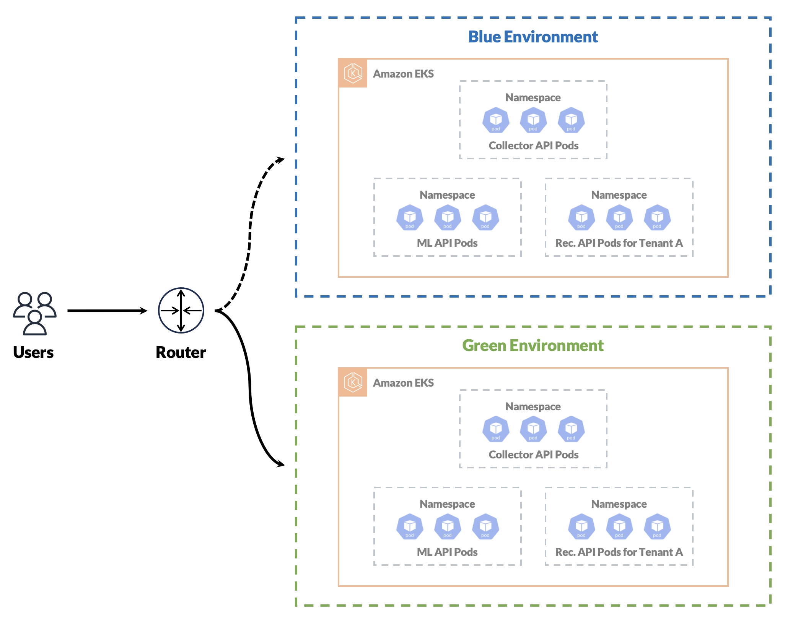
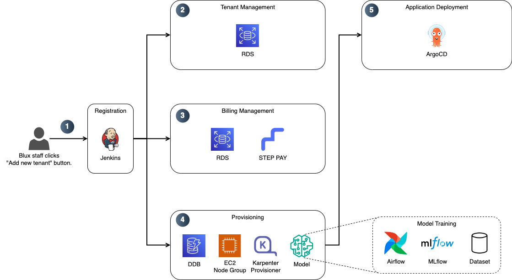
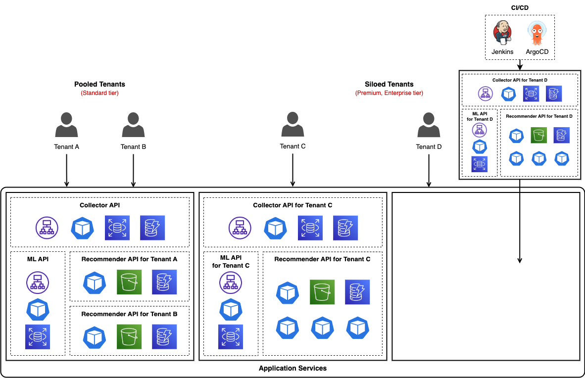
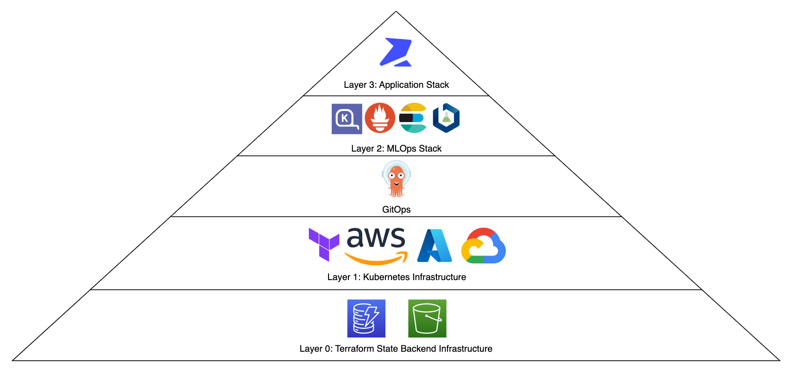
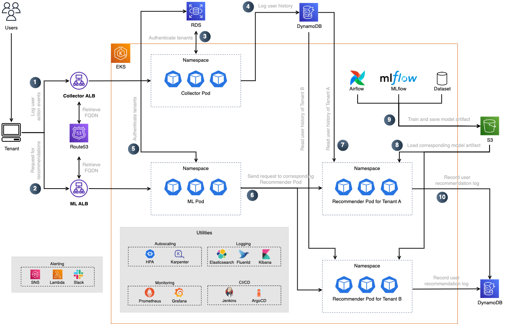
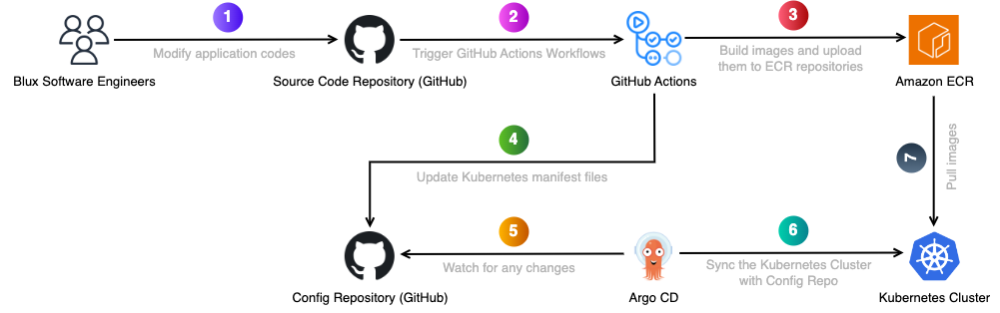

> 🌐 *이 페이지는 한국어로 작성되었습니다.*  
> 👉 *[Click here for English version](https://github.com/sunhongmin225/sunhongmin225/blob/main/README.en.md)*

<h1 align="center">안녕하세요, DevOps Engineer 민선홍입니다.</h1>

## 📌 Table of Contents

- [💼 Work Experience](#-work-experience)
- [🎓 Education](#-education)
- [🏢 About Blux](#-about-blux)
- [🚀 Projects @ Blux](#-projects--blux)
    - [🔐 글로벌 보안 표준(SOC 2) 검증 준비 및 통과](#-글로벌-보안-표준soc-2-검증-준비-및-통과)
    - [🔄 무중단 EKS 클러스터 버전 업그레이드 및 자동화된 Blue-Green 배포 모델 구축](#-무중단-eks-클러스터-버전-업그레이드-및-자동화된-blue-green-배포-모델-구축)
    - [🧩 모범 SaaS 아키텍처 패턴에 따른 EKS 클러스터 고도화](#-모범-saas-아키텍처-패턴에-따른-eks-클러스터-고도화)
    - [🏗️ Production-Grade의 EKS 클러스터 구축 및 ECS to EKS 무중단 Migration](#%EF%B8%8F-production-grade의-eks-클러스터-구축-및-ecs-to-eks-무중단-migration)
- [🗣️ Publications & Talks](#%EF%B8%8F-publications--talks)
    - [🎤 Talks](#-talks)
    - [✍️ Technical Writings](#%EF%B8%8F-technical-writings)
    - [📚 Academic Publications](#-academic-publications)
- [🛠️ Skills & Languages](#%EF%B8%8F-skills--languages)
    - [🔧 Technical Skills](#-technical-skills)
    - [🤝 Soft Skills](#-soft-skills)
    - [🌐 Languages](#-languages)
- [📇 Contact Information](#-contact-information)

## 💼 Work Experience

- [블럭스 (주식회사 제트에이아이)](https://www.blux.ai/) (2023년 1월 - 2025년 6월)
    - *Information Security and DevOps Lead* (2024년 8월 - 2025년 6월)
        - **SOC 2 Type I 및 Type II 전 감사 과정을 주도**했습니다. 그 과정에서 사내 보안 프로토콜 수립 및 교육 실시, 백업 및 복원 테스트 수행, 위험 평가 실시, CloudTrail/WAF/GuardDuty 구성을 포함한 클라우드 보안 강화 등 100개 이상의 항목에 대한 대응을 진행하였습니다. 외부 감사 역시 단독으로 대응하였고, 그 결과 **보안 사고 없이 7개월 내 양 감사를 모두 통과**할 수 있었습니다.
            - 관련 프로젝트 보기 👉 [🔐 글로벌 보안 표준(SOC 2) 검증 준비 및 통과](#-글로벌-보안-표준soc-2-검증-준비-및-통과)
    - *MLOps Engineer* (2023년 1월 - 2024년 8월)
        - **프로덕션용 EKS 클러스터를 스크래치부터 구축**하고, **ECS 워크로드를 무중단으로 마이그레이션**하였습니다. (해당 클러스터는 MAU 1,000만 명 이상이 사용하는 실시간 추천 서비스를 현재까지 주요 장애 없이 안정적으로 운영 중)
            - 관련 프로젝트 보기 👉 [🏗️ Production-Grade의 EKS 클러스터 구축 및 ECS to EKS 무중단 Migration](#%EF%B8%8F-production-grade의-eks-클러스터-구축-및-ecs-to-eks-무중단-migration)
        - **아마존 모범 사례 기반의 멀티 테넌시 SaaS 아키텍처를 설계하고 구현**하였습니다. (자동화된 온보딩, 티어 기반의 사일로/풀 배포 모델, IRSA를 활용한 테넌트 단위 자원 격리 포함)
            - 관련 프로젝트 보기 👉 [🧩 모범 SaaS 아키텍처 패턴에 따른 EKS 클러스터 고도화](#-모범-saas-아키텍처-패턴에-따른-eks-클러스터-고도화)
        - Blue-Green 배포 전략을 활용해 **Kubernetes 클러스터 버전을 무중단으로 업그레이드**하고, **신규 클러스터 프로비저닝을 스크립트 기반으로 자동화**하였습니다.
            - 관련 프로젝트 보기 👉 [🔄 무중단 EKS 클러스터 버전 업그레이드 및 자동화된 Blue-Green 배포 모델 구축](#-무중단-eks-클러스터-버전-업그레이드-및-자동화된-blue-green-배포-모델-구축)

## 🎓 Education

- 서울대학교 컴퓨터공학부 석사 (2021년 3월 - 2023년 2월)
    - [아키텍처 및 코드 최적화 연구실](https://arc.snu.ac.kr/)에서 대규모 데이터셋 처리 및 시스템 설계를 연구했습니다.
- 서울대학교 산업공학과, 컴퓨터공학부 학사 (복수 전공, 2014년 3월 - 2021년 2월)

## 🏢 About Blux

- [블럭스(법인명: 주식회사 제트에이아이)](https://www.blux.ai/)는 **초개인화 상품 추천 및 CRM 마케팅 솔루션**을 제공하는 B2B SaaS 스타트업으로, 기업의 수익 성장을 돕는 AI 기반 제품을 개발하고 있습니다.
- Blux Recommendation은 실시간 사용자 행동 데이터를 기반으로 한 개인화 상품 추천 솔루션으로, **월 1,000만 명 이상의 최종 사용자에게 100% 실시간 추천을 제공**하며, 커머스 기업들의 구매 전환율을 도입 이전 대비 최대 7배 향상시키는 성과를 내고 있습니다.
- Blux Message는 다양한 메시징 채널을 통해 사용자별로 최적의 콘텐츠, 발송 타이밍, 수단을 실시간으로 결정하여 마케팅 캠페인을 실행하는 초개인화 CRM 마케팅 솔루션입니다.
- 블럭스는 클라이언트별 맞춤형 AI 모델 개발부터 실서비스 적용까지의 전체 과정을 자체적으로 제공하며, 전통적인 방식으로 수 개월이 소요되던 추천 시스템 구축을 단 몇 시간 내에 가능하게 하는 **자동화된 SaaS 환경**을 제공합니다.

## 🚀 Projects @ Blux

### 🔐 글로벌 보안 표준(SOC 2) 검증 준비 및 통과

*2024년 8월 - 2025년 3월*

**배경**

- 블럭스는 국내외 여러 대기업을 대상으로 B2B SaaS 서비스를 제공하고 있는데, 영업 과정에서 **SOC 2 등 글로벌 보안 표준의 인증 여부가 선제 조건**으로 요구되는 사례가 다수 발생하였습니다.
- 2024년 4월에 저의 리드 하에 저희의 제품이 **[AWS Foundational Technical Review(FTR)](https://aws.amazon.com/ko/partners/foundational-technical-review/)를 통과**하며 전반적인 클라우드 보안 상태를 점검한 바가 있었으나, **SOC 2나 ISO 27001와 같은 글로벌 수준의 보안 요건**을 기준으로 보았을 때는 **백업 정책, 엔드포인트 보호, 재해 복구 계획 등 실질적인 보안 체계가 미흡한 상태**였습니다.
- 이에 따라 블럭스의 **보안 체계를 글로벌 기준에 맞게 정비**하고, **SOC 2 Type I 및 Type II 보고서를 발급받는 것**을 본 프로젝트의 최종 목표로 삼았습니다.
- 저는 MLOps 엔지니어로서의 기존 역할을 확장하여, 2024년 8월부터 **회사 내 유일한 보안 담당자로서 SOC 2 프로젝트를 리드**하게 되었습니다.

**수행한 내용**

- **Drata 기반 보안 프레임워크 구축**: SOC 2 보안 기준에 따라 보안 관리 체계를 정립하기 위해 **Drata 플랫폼을 도입**하였습니다. Drata에서 요구하는 100개 이상의 컨트롤을 기준으로 조직의 기술·관리적 보안 항목을 체계적으로 점검하였으며, 이를 바탕으로 **보안 정책 수립, 각종 증빙 관리, 자동화된 컴플라이언스 트래킹** 등을 일관되게 수행할 수 있도록 기반을 마련했습니다.
- **보안 통제 및 인프라 대응 체계 강화**
    - **위험 평가 및 보안 정책 수립**: 다양한 기술·운영 리스크 항목에 대한 사전 위험 평가(Risk Assessment)를 수행하고, 이에 기반하여 전사 정보보안 정책 및 하위 세부 정책들을 체계적으로 수립하였습니다.
    - **주기적 백업 및 복원 테스트 수행**: `S3`, `RDS`, `MongoDB` 등 주요 스토리지를 대상으로 백업 플랜을 마련하고 복원 테스트를 주기적으로 수행하였습니다.
    - **비즈니스 연속성 및 재해 복구 (BC/DR) 계획 수립**: 업무 중단 상황에 대비한 RTO 및 RPO 설정과 함께, 전사적인 비즈니스 연속성 계획을 수립하고 문서화하였습니다.
    - **사내 보안 교육 및 사용자 관리 체계화**: 연간 보안 교육을 정례화하고, 입·퇴사자 보안 체크리스트 및 권한 회수 절차를 수립하였습니다.
- **클라우드 보안 관련 주요 조치**
    - **계정 및 권한 관리 강화:**
        - 서비스 및 사용자 역할별로 `IAM Role`을 세분화하고 최소 권한 원칙을 적용하였습니다.
        - `CloudTrail`을 통해 모든 API 호출 및 리소스 변경 이력을 로깅하고, 계정 오남용이나 권한 오용 여부를 실시간으로 추적할 수 있도록 구성하였습니다.
    - **위협 탐지 및 방어 체계 구성:**
        - `WAF`의 여러 규칙을 통해 IP 차단, Header 기반 필터링, Rate Limiting을 설정하여 주요 엔드포인트를 DoS와 악의적 접근 등 외부 위협으로부터 보호하였습니다.
        - `GuardDuty`를 통해 의심스러운 IAM 활동, 네트워크 접근, 외부 침투 시도 등을 탐지하고, `SNS`를 통한 경고 알림 체계를 구축하였습니다.
- **외부 감사 대응 및 여러 이해관계자와의 협업**
    - 외부 감사 기관인 AssuranceLab과의 협업을 통해 **감사 전 사전 질의 대응**, **컨트롤 매핑 검토**, **증빙 제출 프로세스**를 전담하였습니다. 100건 이상의 증빙(스크린샷, 설정 내역, 운영 로그 등)을 수집 및 정리하고, 감사관의 질의에 대한 기술적 대응과 모든 문서화 작업을 직접 수행하였습니다.
    - 해외 여러 기관 및 다양한 내부/외부 이해관계자들과의 협업 과정에서 **명확하고 신속한 커뮤니케이션**을 바탕으로 감사 대응을 원활하게 해냈습니다.

**결과**

- **약 7개월 내에 SOC 2 Type I 및 Type II 보고서를 모두 발급받는 데 성공**하였습니다.
- 구성원들의 보안 인식이 크게 향상되었으며, 클라우드 보안 관련 주요 조치를 통해 **실질적인 보안 위협을 줄이거나 예방할 수 있었습니다.**
    - 인증 준비 기간과 이후 운영 기간을 통틀어 **보안 관련 사고는 한 건도 발생하지 않았으며**, 감사기관으로부터 체계적이고 실질적인 보안 통제 체계를 갖추고 있다는 긍정적인 평가를 받았습니다.
- SOC 2 보고서를 통해 고객사와의 미팅 시 신뢰도를 확보할 수 있었고, **세일즈 팀에서는 강력한 셀링 포인트로 활용**하고 있다는 피드백을 받았습니다.
- **사내에 보안 조직이나 전담 인력이 없는 상태에서 글로벌 보안 표준을 성공적으로 통과한 경험**은 블럭스의 보안 및 기술 역량과 실행력을 외부에 입증하는 계기가 되었으며, 그 성과를 인정받아 **AWS Unicorn Day 2025 발표자로 선정되어 관련 주제로 발표를 진행**하였습니다.

**참고 자료**

- [📝 [2025년 5월, 블럭스 블로그] 블럭스의 SOC 2 보안 여정과 우리가 남긴 기록](https://blog.blux.ai/%EB%B8%94%EB%9F%AD%EC%8A%A4%EC%9D%98-soc-2-%EB%B3%B4%EC%95%88-%EC%97%AC%EC%A0%95%EA%B3%BC-%EC%9A%B0%EB%A6%AC%EA%B0%80-%EB%82%A8%EA%B8%B4-%EA%B8%B0%EB%A1%9D-49217)
- [📰 [2025년 3월, AWS Unicorn Day] 블럭스의 SaaS 서비스를 위한 보안 여정 (feat. SOC 2)](https://blog.blux.ai/aws-unicorn-day-2025%EC%97%90%EC%84%9C-%EC%A0%84%ED%95%98%EB%8A%94-%EB%B8%94%EB%9F%AD%EC%8A%A4%EC%9D%98-%EB%B3%B4%EC%95%88-%EC%A0%84%EB%9E%B5-48063)
    - [📄 발표 자료 보기 (PDF)](./assets/AWS_Unicorn_Day_2025_Deck.pdf)

### 🔄 무중단 EKS 클러스터 버전 업그레이드 및 자동화된 Blue-Green 배포 모델 구축

*2024년 5월 - 2024년 7월*

**배경**

- 기존에 사용 중이던 EKS 클러스터의 Kubernetes 버전이 곧 공식 지원 종료(EOL)를 앞두고 있어, 클러스터 버전 업그레이드가 필요한 상황이었습니다. 그러나 운영 중인 클러스터를 직접 업그레이드할 경우 블럭스가 운영하는 서비스의 일시 중단이 발생할 수 있었고, 이는 **최종 사용자 1,000만 명 이상에게 서비스 화면 공백 등의 형태로 심각한 영향을 줄 수 있는 리스크**를 의미했습니다. 이러한 이유로 기존 클러스터를 직접 수정하는 방식이 아닌, **새로운 클러스터를 별도로 구축한 뒤 점진적으로 전환하는 Blue-Green 배포 모델**을 통해 안전하게 클러스터를 교체하는 접근이 필요했습니다.
- 본 프로젝트의 주요 목표는 다음과 같았습니다:
    - 기존 클러스터에서 새로운 버전의 클러스터로 **무중단 상태로 전환**할 것
    - **Blue-Green 배포 모델**을 기반으로 안전하게 전환하며, 추후 동일한 작업을 반복 수행할 수 있도록 **인프라 생성 절차를 자동화**할 것

**수행한 내용**

  

- **Blue-Green 클러스터 전략 설계 및 트래픽 전환**
    - 기존 운영 중인 클러스터를 직접 업그레이드하지 않고, 신규 Kubernetes 버전의 EKS 클러스터를 별도로 생성하여 `blux-eks-cluster-prod-blue`, `blux-eks-cluster-prod-green` 형식으로 병렬 운영이 가능하도록 구성하였습니다.
    - 서비스 전환은 Route 53의 `Weighted Routing` 기능을 활용하여 트래픽을 점진적으로 신규 클러스터로 분산 전환하는 방식으로 진행하였습니다.
- **클러스터 프로비저닝 자동화 및 스크립트화**: 향후 반복적인 업그레이드나 마이그레이션 작업에 대비하여, 자체적으로 정의한 Layer 0부터 Layer 3까지 **전체 인프라 생성 및 설정을 Shell Script로 자동화**하였습니다. 이를 통해 동일한 구성을 신속하게 재현 가능하도록 하였으며, 개발 환경(`prod`, `dev`)과 배포 모델(`blue`, `green`)만 다르게 설정하면 신규 클러스터를 자동으로 구성할 수 있는 기반을 마련했습니다.
- **모니터링 기반 마이그레이션 검증 및 안정성 확인**: 클러스터 전환 도중에는 `Prometheus`, `Loki`, `Grafana`를 통해 실시간 관측 데이터와 로그를 수집하고, 다음과 같은 지표를 중심으로 상태를 면밀히 모니터링했습니다:
    - 주요 API의 HTTP 응답 코드 분포 (2XX, 4XX, 5XX 비율)
    - API 별 응답 속도 및 처리 시간
    - 서비스별 요청 성공률 및 오류 발생 추이
- **ALB Access Logs (S3) 분석을 통한 무중단 여부 확인**: Route 53 트래픽 분산 이후, ALB 로그에서 대상 클러스터의 백엔드 IP 분포와 응답 상태를 분석하여 요청이 정상적으로 새로운 클러스터로 라우팅되었는지, 그리고 오류 없이 처리되었는지를 검증하였습니다.
- 위 지표들을 기반으로 마이그레이션 중 문제 유무를 탐지하고, 이상 징후 발생 시 즉시 대응할 수 있도록 준비하였습니다.

**결과**

- 클러스터 업그레이드를 **다운타임 없이 성공적으로 완료**하였습니다.
    - 트래픽 전환 중에도 안정성을 유지할 수 있었고, 별다른 이슈 없이 마이그레이션을 마무리하였습니다.
- 클러스터 구성 자동화 스크립트를 갖춤으로써, DevOps 관점에서 향후 유사한 작업을 반복 수행할 때의 **효율성을 크게 개선**하였고, 필요 시 **롤백 또한 용이한 구조**로 운영할 수 있게 되었습니다.

**참고 자료**

- [📝 [2024년 8월, 블럭스 블로그] 무중단으로 EKS 클러스터 버전 업그레이드하기](https://blog.blux.ai/%EB%AC%B4%EC%A4%91%EB%8B%A8%EC%9C%BC%EB%A1%9C-eks-%ED%81%B4%EB%9F%AC%EC%8A%A4%ED%84%B0-%EB%B2%84%EC%A0%84-%EC%97%85%EA%B7%B8%EB%A0%88%EC%9D%B4%EB%93%9C%ED%95%98%EA%B8%B0-25859)

### 🧩 모범 SaaS 아키텍처 패턴에 따른 EKS 클러스터 고도화

*2023년 6월 - 2023년 10월*

**배경**

- 블럭스의 고객사 수가 늘어남에 따라, 온보딩 과정에 다수의 인적 리소스가 반복적으로 투입되고 있었습니다. PO, SW 및 ML 엔지니어 등 여러 인력이 수동으로 개입해야 했으며, 이로 인해 휴먼 에러 발생 가능성도 존재하였습니다.
- 테넌트의 규모와 요구사항이 다양해지면서, 소형 테넌트는 비용 효율성을, 대형 테넌트는 전용 자원 및 개별화된 관리(예: 단독 엔드포인트)를 요구하는 사례가 늘어났습니다. 기존의 단일 구조에서는 이러한 다양한 수요를 유연하게 수용하기 어려웠습니다.
- 본 프로젝트의 목표는 다음과 같았습니다:
    - 신규 테넌트가 **3시간 이내에 자동으로 온보딩**될 수 있도록 자동화된 프로세스를 구축할 것
    - 테넌트의 규모 및 **티어에 따라 각기 다른 배포 모델을 활용**할 것
    - **티어별 자원 격리 수준을 설정**하고, 상위 티어 테넌트에게는 전용 노드 자원을 제공할 것

**수행한 내용**

  

- **온보딩 자동화 파이프라인 구축**: 테넌트 온보딩 과정의 수작업을 제거하기 위해 `Jenkins` 기반의 자동화 파이프라인을 구축하였습니다. 블럭스 내부 콘솔에서 ‘Add new tenant’ 버튼 클릭 시 Jenkins Job이 트리거되어 1) 신규 테넌트 정보를 RDS에 기록하고, 2) 콘텐츠 기반 추천 모델 학습을 명령하며, 3) 테넌트의 환경에 맞는 Kubernetes 리소스 정의 파일을 포함한 GitHub repository 변경사항을 Push 합니다. 이후 `Argo CD`가 변경 사항을 감지하여, 해당 테넌트를 위한 Collector/ML/Recommender API 등의 서비스가 **자동으로 배포**되도록 구성하였습니다.

  

- **다중 티어 구조 설계 및 배포 전략 적용**: 테넌트 규모 및 요구사항의 다양성을 고려해, Standard/Premium/Enterprise 세 가지 서비스 티어를 정의하였습니다.
    - `Standard 티어`는 `Pool 모델`로, 각 테넌트가 전용의 Recommender API 및 학습된 추천 모델은 따로 보유하지만, **Collector 및 ML API는 공용 인프라와 엔드포인트를 통해 공유**합니다. 또한, 전용 노드 없이 **공유 NodePool**에서 실행되므로, 사용량이 비교적 적은 테넌트에게 적합할 것이라고 판단했습니다.
    - `Premium 및 Enterprise 티어`는 `Silo 모델`로, **Recommender API는 물론 Collector 및 ML API까지 각기 별도의 엔드포인트와 인프라 리소스로 분리되어 배포**됩니다. 또한, 각 테넌트는 **전용 NodePool**에서 실행되어 물리적으로도 자원이 격리됩니다. 이를 통해 테넌트별 데이터 및 트래픽을 완전히 분리할 수 있어, 높은 보안 요구 사항이나 SLA가 필요한 테넌트에게 안정성과 유연성을 동시에 제공할 수 있게 되었습니다.
- **자원 격리 구조 수립**
    - 모든 테넌트는 `네임스페이스` 단위로 분리되며, 각 워크로드에는 `IRSA(IAM Roles for Service Accounts)`를 적용해 AWS 리소스 접근 권한까지 논리적으로 격리하였습니다.
    - 특히 상위 티어의 경우, 전용 `NodePool`을 구성하여 해당 테넌트의 워크로드가 물리적으로 독립된 EC2 노드에서만 동작하도록 설계하였습니다. 이를 통해 고트래픽 테넌트가 다른 테넌트에게 자원 영향을 주는 Noisy Neighbor 현상을 근본적으로 차단하고, 고가용성과 성능 일관성을 보장할 수 있었습니다.

**결과**

- 기존 수작업 기반 온보딩 과정이 **약 2~3시간 내외로 단축**되었으며, 반복 작업에 투입되던 인적 리소스를 대폭 절감하였습니다.
- 온보딩 안내, SDK 삽입, 모델 학습, 자원 설정 등의 과정이 상당 부분 자동화되면서 **운영 효율성이 크게 향상**되었습니다.
- 테넌트의 다양한 요구사항을 티어별로 유연하게 반영할 수 있는 SaaS 구조를 구축하여, **맞춤형 구독 모델**을 제공할 수 있게 되었습니다.
- 상위 티어 테넌트에게는 **전용 노드를 통한 성능 보장과 단독 엔드포인트를 통한 보안 우려 해소**를 제공함으로써, 고객 만족도를 높이는 데 기여하였습니다.
- 해당 프로젝트는 EKS 상에서 AWS SaaS 아키텍처의 Best Practice를 효과적으로 반영한 사례로 인정받아, **AWS Korea 공식 기술 블로그에 해당 내용을 게재**하였으며, **AWS Unicorn Day 2024 행사에서 동일한 주제로 발표를 진행**하였습니다.

**참고 자료**

- [📝 [2023년 11월, AWS 기술 블로그] Blux(구 Z.Ai)의 Amazon EKS 기반 AWS SaaS 아키텍처 주요 패턴 적용 사례](https://aws.amazon.com/ko/blogs/tech/blux-adopting-aws-saas-architecture/)
- [🎥 [2024년 3월, AWS Unicorn Day] [Track 3-4] SaaS 솔루션 구축을 위한 주요 기술 고려 사항과 Blux의 AI SaaS 솔루션 구축 사례](https://youtu.be/QKi14XpHY7M?si=KC5pfXqaEd_y4SOZ&t=1267)
    - [📄 발표 자료 보기 (PDF)](./assets/AWS_Unicorn_Day_2024_Deck.pdf)

### 🏗️ Production-Grade의 EKS 클러스터 구축 및 ECS to EKS 무중단 Migration

*2023년 1월 - 2023년 5월*

**배경**

- 블럭스는 초기에는 고객사별로 Amazon ECS 기반의 개별 클러스터를 운영하고 있었지만, 고객사의 수가 늘어나면서 **비용, 운영 복잡도, 확장성 측면에서 한계를 체감**하게 되었습니다. ECS는 vCPU와 메모리 조합이 고정되어 있어 **자원 낭비가 발생하기 쉬웠고**, **멀티테넌시 구조를 구성하기 어렵고**, **AWS에 종속적인 구조**였기 때문에 장기적인 확장성과 유연성이 부족하다고 판단했습니다.
- 이에 반해, Amazon EKS 기반 Kubernetes는 **자유로운 자원 설정**, **네임스페이스 기반 멀티테넌시**, **Rolling/Canary/Blue-Green 등 다양한 배포 전략**, 그리고 **광범위한 오픈소스 생태계** 등을 통해 높은 유연성과 자동화된 운영이 가능하다고 보았습니다.
- 내부적으로도 “고객사가 더 늘어나기 전에 Kubernetes로 전환하자”는 의견이 모였고, **EKS가 장기적으로 더 유리한 선택이라는 판단 아래**, 마이그레이션을 진행하게 되었습니다.
- 블럭스의 유일한 MLOps 엔지니어로서, **EKS 클러스터를 스크래치에서부터 Production 수준으로 구축**하고, **모든 ECS 워크로드를 무중단으로 마이그레이션**하는 전 과정을 혼자서 담당했습니다. 클러스터는 다음 조건을 만족해야 했습니다:
    - **IaC** 및 재현 가능하고 일관된 클러스터 구성
    - 안정적인 **오토스케일링**, **로깅/모니터링**, **보안 관리**, **CI/CD 파이프라인** 지원
    - **Airflow, MLflow 기반 ML 파이프라인** 지원

**수행한 내용**

  

- **인프라 설계 및 운영 자동화**: 전체 인프라는 유지보수성과 확장성을 고려하여 자체적으로 정의한 **Layer 0부터 Layer 3까지 총 4단계**로 계층화하여 구성했습니다. 각 계층은 역할과 클라우드 의존성에 따라 분리하였으며, 모든 배포는 `Terraform`, `Helm`, `Argo CD`를 활용해 `GitOps` 기반으로 관리했습니다.
    - 총 4단계의 Layers
        - **Layer 0**: Terraform 상태 저장소를 위한 S3, DynamoDB (now deprecated) 등 백엔드 인프라
        - **Layer 1**: 클라우드 기반 Kubernetes 클러스터 및 시스템 인프라 (EKS, EC2 노드 그룹, IAM, KMS 등)
        - **Layer 2**: MLOps 및 GitOps 스택 구성
        - **Layer 3**: 실제 블럭스 애플리케이션
    - Layer 0과 1은 AWS와 같은 클라우드 리소스를 직접 사용하기 때문에 클라우드 종속적인 계층이며, Layer 2와 3은 상대적으로 클라우드 독립적인 구성으로서 다양한 환경에서도 동일한 방식으로 재현이 가능하도록 설계했습니다. 이를 통해 **보안, 확장성, 안정성, 재현 가능성**을 모두 고려한 Production-Grade 인프라를 구현했습니다.

  

- **MLOps 스택 구성**
    - 오토스케일링 전략으로 `HPA (Horizontal Pod Autoscaler)`와 `Karpenter`를 함께 사용하여 워크로드 레벨과 인프라 레벨 모두에서 오토스케일링을 구현했습니다. 모든 워크로드는 `NodePools`(당시에는 `Provisioners`)로 운영하여 비용을 최적화했습니다.
    - 관측 가능성 확보를 위해 `Prometheus`와 `Grafana`를 활용하여 메트릭 기반 모니터링 체계를 구축하였고, `EFK` 스택(Elasticsearch, Fluentd, Kibana)을 통해 로깅 아키텍처를 구성하였습니다. 이후 운영 효율성과 비용을 고려하여, 리소스 사용량이 더 적은 `PLG` 스택(Promtail, Loki, Grafana)으로 전환하였습니다.
    - `Airflow`와 `MLflow`를 클러스터에 배포하고, Airflow DAG은 `KubernetesPodOperator`를 사용하여 작업 시점에만 Worker 노드를 띄우고 종료하는 구조로 구성했습니다. 이 때 `NodePools`과 `Taints` 및 `Tolerations`를 활용해 해당 작업을 수행하는 Worker 노드를 자동 생성/삭제하여 자원을 효율적으로 사용할 수 있었습니다.

  

- **CI/CD 및 GitOps 기반 운영**: `GitHub repository`와 `Argo CD`를 연동하여 `GitOps` 환경을 구성했습니다. 모든 배포를 `GitHub Actions`과 사람들이 올리는 PR 기반으로 관리하였으며, 승인된 변경 사항은 Argo CD가 자동으로 클러스터에 반영하도록 하였습니다. 일부 커스텀 작업은 `Jenkins`와 연동해 처리했습니다.
- **워크로드 설계 및 보안 강화**: 기존 ECS 서비스들을 Kubernetes 환경에 맞게 마이그레이션하고, 외부 노출이 불필요한 워크로드는 클러스터 내부에서만 접근 가능하도록 구성했습니다. 그리고 `PodDisruptionBudget`와 `TopologySpreadConstraints`를 설정해 장애 발생 시에도 안정적인 서비스를 유지할 수 있도록 했습니다. 또한 보안을 위해 Kubernetes Secrets는 `SealedSecrets`로 안전하게 암호화하여 관리하였습니다.
- **무중단 트래픽 마이그레이션**: Route 53의 `Weighted Routing` 기능을 활용해, ECS to EKS로의 트래픽 전환을 점진적으로 (0:100 → 100:0) 수 일에 걸쳐 진행했습니다. 지속적인 메트릭 모니터링을 통해 장애 없이 전환을 마무리했습니다.

**결과**

- 스크래치에서부터 구축한 EKS 클러스터는 **IaC 기반으로 구성되어 재현성과 일관성을 갖춘 프로덕션 인프라 환경을 성공적으로 구현**하였습니다.
- 워크로드 및 인프라 수준의 **오토스케일링 시스템을 구축**하여 안정적인 자동화 운영 환경을 확보했습니다.
- 로깅/모니터링, GitOps 기반의 배포 체계, 보안 구성, ML 워크플로우까지 포함한 **MLOps 스택을 완성**하였습니다.
- 기존 ECS 구조 대비 **약 25%의 인프라 비용 절감**을 달성하였고, 인프라 리소스를 코드화함으로써 **관리 복잡도를 크게 낮추고 투명성을 높일 수 있었습니다.**
- 모든 ECS 워크로드를 EKS로 **무중단 마이그레이션**하여 전환에 따른 사용자 영향 없이 성공적으로 전환을 마쳤습니다.
- 해당 클러스터는 현재까지도 주요 서비스를 **크리티컬한 장애 없이 2년 넘게 안정적으로 운영**하고 있습니다.

**참고 자료**

- [📝 [2025년 2월, 블럭스 블로그] Argo CD와 깃옵스를 활용한 블럭스의 쿠버네티스 자원 관리 노하우](https://blog.blux.ai/argo-cd%EC%99%80-%EA%B9%83%EC%98%B5%EC%8A%A4%EB%A5%BC-%ED%99%9C%EC%9A%A9%ED%95%9C-%EB%B8%94%EB%9F%AD%EC%8A%A4%EC%9D%98-%EC%BF%A0%EB%B2%84%EB%84%A4%ED%8B%B0%EC%8A%A4-%EC%9E%90%EC%9B%90-%EA%B4%80%EB%A6%AC-%EB%85%B8%ED%95%98%EC%9A%B0-41764)
- [📝 [2024년 1월, 블럭스 블로그] Kubernetes 환경에서 HPA와 Karpenter를 이용하여 Autoscaling 시스템 구축하기](https://blog.blux.ai/kubernetes-%ED%99%98%EA%B2%BD%EC%97%90%EC%84%9C-hpa%EC%99%80-karpenter%EB%A5%BC-%EC%9D%B4%EC%9A%A9%ED%95%98%EC%97%AC-autoscaling-%EC%8B%9C%EC%8A%A4%ED%85%9C-%EA%B5%AC%EC%B6%95%ED%95%98%EA%B8%B0-17394)
- [📝 [2024년 1월, 블럭스 블로그] GitHub Public Repository에 올려도 되는 안전한 Kubernetes Secrets, ‘Sealed Secrets’](https://blog.blux.ai/sealed-secrets-github-public-repository%EC%97%90-%EC%98%AC%EB%A0%A4%EB%8F%84-%EB%90%98%EB%8A%94-%EC%95%88%EC%A0%84%ED%95%9C-kubernetes-secrets-17393)

## 🗣️ Publications & Talks

### 🎤 Talks

- [📰 [2025년 3월, AWS Unicorn Day] 블럭스의 SaaS 서비스를 위한 보안 여정 (feat. SOC 2)](https://blog.blux.ai/aws-unicorn-day-2025%EC%97%90%EC%84%9C-%EC%A0%84%ED%95%98%EB%8A%94-%EB%B8%94%EB%9F%AD%EC%8A%A4%EC%9D%98-%EB%B3%B4%EC%95%88-%EC%A0%84%EB%9E%B5-48063)
    - [📄 발표 자료 보기 (PDF)](./assets/AWS_Unicorn_Day_2025_Deck.pdf)
- [📰 [2024년 10월, AWS 2024 SaaS Developer Bootcamp] 블럭스의 AI SaaS 솔루션 구축 사례](https://blog.blux.ai/%EB%B8%94%EB%9F%AD%EC%8A%A4%EA%B0%80-%EC%A0%84%ED%95%98%EB%8A%94-aws-saas-%EC%A0%84%ED%99%98%EC%9D%98-%EC%84%B1%EA%B3%B5-%EB%B9%84%EA%B2%B0-33488)
- [🎥 [2024년 3월, AWS Unicorn Day] [Track 3-4] SaaS 솔루션 구축을 위한 주요 기술 고려 사항과 Blux의 AI SaaS 솔루션 구축 사례](https://youtu.be/QKi14XpHY7M?si=KC5pfXqaEd_y4SOZ&t=1267)
    - [📄 발표 자료 보기 (PDF)](./assets/AWS_Unicorn_Day_2024_Deck.pdf)

### ✍️ Technical Writings

- [📝 [2025년 5월, 블럭스 블로그] 블럭스의 SOC 2 보안 여정과 우리가 남긴 기록](https://blog.blux.ai/%EB%B8%94%EB%9F%AD%EC%8A%A4%EC%9D%98-soc-2-%EB%B3%B4%EC%95%88-%EC%97%AC%EC%A0%95%EA%B3%BC-%EC%9A%B0%EB%A6%AC%EA%B0%80-%EB%82%A8%EA%B8%B4-%EA%B8%B0%EB%A1%9D-49217)
- [📝 [2025년 2월, 블럭스 블로그] Argo CD와 깃옵스를 활용한 블럭스의 쿠버네티스 자원 관리 노하우](https://blog.blux.ai/argo-cd%EC%99%80-%EA%B9%83%EC%98%B5%EC%8A%A4%EB%A5%BC-%ED%99%9C%EC%9A%A9%ED%95%9C-%EB%B8%94%EB%9F%AD%EC%8A%A4%EC%9D%98-%EC%BF%A0%EB%B2%84%EB%84%A4%ED%8B%B0%EC%8A%A4-%EC%9E%90%EC%9B%90-%EA%B4%80%EB%A6%AC-%EB%85%B8%ED%95%98%EC%9A%B0-41764)
- [📝 [2024년 8월, 블럭스 블로그] 무중단으로 EKS 클러스터 버전 업그레이드하기](https://blog.blux.ai/%EB%AC%B4%EC%A4%91%EB%8B%A8%EC%9C%BC%EB%A1%9C-eks-%ED%81%B4%EB%9F%AC%EC%8A%A4%ED%84%B0-%EB%B2%84%EC%A0%84-%EC%97%85%EA%B7%B8%EB%A0%88%EC%9D%B4%EB%93%9C%ED%95%98%EA%B8%B0-25859)
- [📝 [2024년 5월, 블럭스 블로그] Kinesis Data Streams로 실시간 스트리밍 데이터 S3에 적재하기](https://blog.blux.ai/kinesis-%EC%8A%A4%ED%8A%B8%EB%A6%AC%EB%B0%8D-%EB%8D%B0%EC%9D%B4%ED%84%B0%EC%B2%98%EB%A6%AC-%EC%95%84%ED%82%A4%ED%85%8D%EC%B3%90-0522)
- [📝 [2024년 1월, 블럭스 블로그] Kubernetes 환경에서 HPA와 Karpenter를 이용하여 Autoscaling 시스템 구축하기](https://blog.blux.ai/kubernetes-%ED%99%98%EA%B2%BD%EC%97%90%EC%84%9C-hpa%EC%99%80-karpenter%EB%A5%BC-%EC%9D%B4%EC%9A%A9%ED%95%98%EC%97%AC-autoscaling-%EC%8B%9C%EC%8A%A4%ED%85%9C-%EA%B5%AC%EC%B6%95%ED%95%98%EA%B8%B0-17394)
- [📝 [2024년 1월, 블럭스 블로그] GitHub Public Repository에 올려도 되는 안전한 Kubernetes Secrets, ‘Sealed Secrets’](https://blog.blux.ai/sealed-secrets-github-public-repository%EC%97%90-%EC%98%AC%EB%A0%A4%EB%8F%84-%EB%90%98%EB%8A%94-%EC%95%88%EC%A0%84%ED%95%9C-kubernetes-secrets-17393)
- [📝 [2023년 11월, AWS 기술 블로그] Blux(구 Z.Ai)의 Amazon EKS 기반 AWS SaaS 아키텍처 주요 패턴 적용 사례](https://aws.amazon.com/ko/blogs/tech/blux-adopting-aws-saas-architecture/)

### 📚 Academic Publications

- [📃 [VLDB ‘22] Ginex: SSD-enabled Billion-scale Graph Neural Network Training on a Single Machine via Provably Optimal In-memory Caching](./assets/vldb22_ginex.pdf) by Yeonhong Park, **Sunhong Min**, Jae W. Lee
- [📃 [HPCA ‘22] ANNA: Specialized Architecture for Approximate Nearest Neighbor Search](./assets/hpca22_anna.pdf) by Yejin Lee, Hyunji Choi, **Sunhong Min**, Hyunseung Lee, Sangwon Baek, Dawoon Jeong, Jae W. Lee, Tae Jun Ham
- [📃 [ISCA ‘21] BOSS: Bandwidth-Optimized Search Accelerator for Storage-Class Memory](./assets/isca21_boss.pdf) by Jun Heo, Seung Yul Lee, **Sunhong Min**, Yeonhong Park, Sung Jun Jung, Tae Jun Ham, Jae W. Lee

## 🛠️ Skills & Languages

### 🔧 Technical Skills

- 클라우드 및 DevOps
    - 인프라: AWS, Kubernetes, Helm, Terraform
    - 오토스케일링: HPA, Karpenter
    - 로깅 및 모니터링: Prometheus, Loki, Grafana, Elasticsearch, Fluentd, Kibana
    - CI/CD 및 GitOps: Jenkins, GitHub Actions, Argo CD
- 프로그래밍 언어: Python, Java, C++, TypeScript
- 운영 환경 및 도구: Linux, Git, Docker

### 🤝 Soft Skills

- **글쓰기**를 좋아합니다. 특히 제가 했던 작업을 **쉬운 말로 정리하여 기록으로 남겨놓는 것**을 잘합니다.
- **완성도 높은 발표 자료**를 만들고 **여러 청중 앞에서 발표**할 수 있습니다.
- **팀원들과 의사소통**할 때 최대한 **이해가 쉽고 오해가 없는 표현**을 사용합니다.
- **정해진 주인이 없는 일을 마다하지 않고 먼저 챙기며**, 팀의 운영과 분위기에 긍정적인 영향을 주기 위해 노력합니다.

### 🌐 Languages

- 한국어: 모국어
- 영어: 능숙함
    - TOEFL 114점 / 120점 (2018년 5월 취득)

## 📇 Contact Information

- 이메일: sunhongmin10@gmail.com
- 거주지: 서울
- GitHub: [https://github.com/sunhongmin225](https://github.com/sunhongmin225/)
- LinkedIn: [https://www.linkedin.com/in/sunhongmin](https://www.linkedin.com/in/sunhongmin/)
